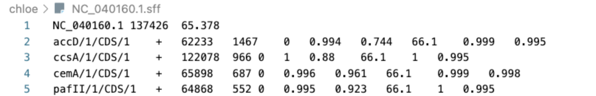
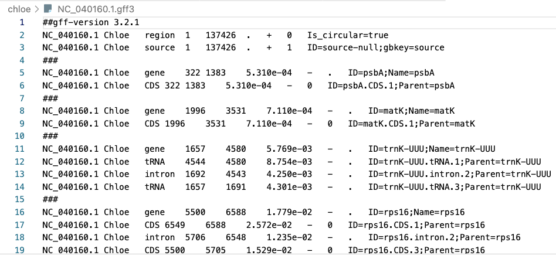

# Chloë: Organelle Annotator

Chloë is optimised for annotating flowering plant (angiosperm) chloroplast genomes. If you would like to use Chloë to annotate chloroplast genomes from other plants (e.g. gymnosperms, ferns, lycophytes or bryophytes), please contact Ian Small (ian.small@uwa.edu.au) for access to future versions of Chloë.

This annotator is available online at: [https://chloe.plastid.org](https://chloe.plastid.org)

--- 

## Table of Contents
- [Installation](#installation)
- [Usage](#usage)
- [Julia Projects](#julia-projects) 
- [Output Formats](#output-formats)
- [Developer recipes](#developer-recipes)
    - [Multithreading](#multithreading)
    - [Distributed](#distributed)
    - [Chloë server](#chloe-server)
    - [Running Remotely](#running-remotely)
- [Authors](#authors)

## Installation

For installing Julia please follow link to [`juliaup`](https://julialang.org/downloads/).

To install the Chloë code as a local folder on your computer: 
```bash
git clone https://github.com/ian-small/chloe
```

#### Chloë References
Chloë references are required and can be cloned from the git repository into the same location as the `chloe` folder. If you want to save them somewhere else you need to specify the path to them.

```bash
git clone https://github.com/ian-small/chloe_references
```

The `Project.toml` file lists all the project
dependencies. To instantiate go into the `chloe` directory and type: 
```bash
julia --project=.
```
In the Julia REPL type `]` and `instantiate` at the julia prompt to install all the required
packages. 

## Usage

You can run Chloë from the terminal. To access the annotator help manual use:

```bash
julia --project=. chloe.jl annotate --help
```

For annotating single sequences (e.g. the test genome `NC_020019.1.fa` available in the folder `testfa` with the default output in `.sff` format:
```bash
julia --project=. chloe.jl annotate testfa/NC_020019.1.fa
```

For annotating all fasta file in a directory ending with `.fa` specifying the `.gff` output format: 

```bash
julia --project=. chloe.jl annotate -g testfa/*.fa
```

This will create `.gff` files for each fasta file and write them back into the directory where the annotated fasta files are located.

To see what other commands are available:

```bash
julia --project=. chloe.jl --help
```

Annotate fasta files from command line specifying the location of your Chloë references
```bash
julia --project=. -e 'using Chloe; chloe_main()' -- \
    annotate --reference=/path/to/chloe_references *.fa
```

## Julia Projects
You can install Chloë as a Julia package and environment from within the Julia REPL. To create a project in your directory `myproject` initiate a Julia project and add Chloë as a package:

```bash
# create a Julia project in directory myproject
julia -e 'using Pkg; Pkg.generate("myproject")'
cd myproject
# add Chloe to the project
julia --project=. -e 'using Pkg; Pkg.add(url="https://github.com/ian-small/chloe.git")'
```
To install the [`Chloe References`](https://github.com/ian-small/chloe_references) database in the Julia REPL use:
```bash
julia -e 'import Pkg; Pkg.GitTools.clone(stdout, "https://github.com/ian-small/chloe_references", "chloe_references")'
```
### Using the Julia REPL
Now you can start the Julia REPL and import the Chloë package. Chloë needs to know where the `chloe_references` are. If you have the references in your project directory use `"./chloe_references" ` is you decided to download them somewhere else you need to pass the path to the `reference` variable. Then run the `annotate` function to annotate your file. (If you have your files elsewhere please define the path to your file).  

As an example of how to annotate a single FASTA file that is in your project directory:
```julia
#start the julia REPL from the terminal in your projects folder then import Chloe
import Chloe
references = Chloe.ReferenceDbFromDir("./chloe_references") #set path to the chloe_reference
outfile, uid = Chloe.annotate(references,  "NC_011032.1.fa") #run annotation on a file called NC_011032.1.fa located in your project folder
println(outfile) #print output in REPL
```

Write to buffer instead of to a file.

```julia
import Chloe
references = Chloe.ReferenceDbFromDir("/path/to/chloe_references")
io, uid = Chloe.annotate(references, "NC_011032.1.fa", nothing, IOBuffer())
# show .sff content
println(String(take!(io)))
```

Read from an already open fasta file.


```julia
import Chloe
references = Chloe.ReferenceDbFromDir("/path/to/chloe_references")
outfile, uid = open("NC_011032.1.fa", "r") do io
    Chloe.annotate(references, io)
end
```

--- 
For more recipes using Chloë see our [Recipes](https://github.com/ian-small/chloe/blob/master/RECIPES.md).


## Output formats

Internally, Chloë numbers each strand independently from its 5' end, and tracks features by (start, length) rather then by (start, stop). This avoids most of the issues with features crossing the arbitrary end of a circular genome. The default output of Chloë (`.sff` files) uses these conventions. For example, here's the start of a typical `.sff` output file:





The header line gives the sequence name, the length in nucleotides, and the mean alignment coverage with the reference genomes.
Subsequent lines give information on a single feature or sub-feature.
The first column is a unique identifier, composed as follows:
gene name/gene copy (so if 2 or higher is a duplicate of another gene)/feature type/feature order (can be used to sort exons and introns into the correct order, even for transpliced genes)
Subsequent columns are: strand, start, length, phase;
Then 5 columns of interest if you want to understand why Chloë has predicted this particular feature: length relative to feature template, proportion of references that match, mean coverage of aligned genomes (out of 100), feature probability (from XGBoost model), coding probability (from XGBoost model)

Most users will probably want to use `chloe.jl annotate -g` to obtain the output in standard `.gff` format: 





By default, Chloë filters out features which are detected to have one of a set of problematic issues, or which have a feature probability of < 0.5.
You can retain these putative features by lowering the sensitivity threshold and asking for no filtering. For example, `chloe.jl annotate -s 0 --nofilter` will retain all the features that Chloë was able to detect, including those that fail the checks. Features with issues will be flagged as warnings during the annotation:
```[ Warning: rps16/1 lacks a start codon
[ Warning: rps16/1 has a premature stop codon
[ Warning: rps16/1 CDS is not divisible by 3
```
and in the `.sff` output. Currently `--nofilter` has no effect if the `-g` flag is also set.


## Developer Recipes
### Chloë Server

Running the chloe server. In a terminal type:

```bash
julia -t 8 --project=. distributed.jl --level=info --workers=4 \
     --broker="default"
```

(Julia as of 1.4 refuses to use more threads that the number of CPUs on your machine:
`Sys.CPU_THREADS` or `python -c 'import multiprocessing as m; print(m.cpu_count())'`)

In another terminal start julia:

```julia
using JuliaWebAPI

i = APIInvoker("ipc:///tmp/chloe-client");
apicall(i, "ping") # ping the server to see if is listening.

# fasta and output should be relative to the server'
# working directory, or specify absolute path names! yes "chloe"
# should be "annotate" but...
ret = apicall(i, "chloe", fastafile, outputfile) # outputfile is optional
code, data = ret["code"], ret["data"]
@assert code === 200
# actual filename written and total elapsed
# time in ms to annotate
sff_fname, elapsed_ms = data["filename"], data["elapsed"]
# to terminate the server cleanly (after finishing any work)
apicall(i, "exit")
```

The *actual* production configuration uses `distributed.jl`
(for threading issues) and runs
the server as a client of a DEALER/ROUTER server
(see `bin/broker.py` or `src/broker.jl` and the `Makefile`). It *connects* to the
DEALER end on `tcp://127.0.0.1:9467`. The
[chloe website](https://chloe.plantenergy.edu.au)
connects to `ipc:///tmp/chloe-client` which
is the ROUTER end of broker. In this setup
you can run multiple chloe servers connecting
to the same DEALER.

**Update**: you can now run a broker with julia as `julia src/broker.jl`
*or* specify `--broker=URL` to `distrbuted.jl`. No
python required. (best to use `-b default` to select
this projects default endpoint (`ipc:///tmp/chloe-client`))

The worker process can be made to share the reference Data using memory mapped data files.
You can create these by running:

```sh
julia chloe.jl mmap reference_1116/*.fa
```

### Running Remotely

The Chloë server can be run remotely through a ssh tunnel.

On the remote server:
`git clone ...` the chloe github repo and download the julia runtime (natch!).
*And* install all chloe package dependencies *globally* (see above).

Then -- on your puny laptop -- you can run something like:

```sh
ssh  you@bigserver -t -o ExitOnForwardFailure=yes -L 9476:127.0.0.1:9467 \
    'cd /path/to/chloe;
    JULIA_NUM_THREADS={BIGNUM} /path/to/bin/julia --project=. --startup-file=no --color=yes
    distributed.jl --broker=tcp://127.0.0.1:9467 -l info --workers=4'
```

The port `9467` is an entirely random (but hopefully unused both on
the remote server and locally) port number. The broker port *must* match
the ssh port specified by `-L`. `{BIGNUM}` is the enormous number
of CPUs your server has ;).

Since the remote server has no access to the local filesystem you need
to use `annotate` instead of `chloe` to annotate your your
fasta files e.g:

```julia
using JuliaWebAPI
i = APIInvoker("tcp://127.0.0.1:9467")
# read in the entire fasta file
fasta = read("testfa/NC_020019.1.fa", String)
ret = apicall(i, "annotate", fasta)
code, data = ret["code"], ret["data"]
@assert code === 200
sff = data["sff"] # sff file as a string
# terminate the server
apicall(i, "exit")
```

---


### Authors

* Ian Small: ian.small@uwa.edu.au
* Ian Castleden: ian.castleden@uwa.edu.au
* Conny Hooper: cornelia.hooper@uwa.edu.au
